# 🧪 Lab 1 — Generative Models: GAN vs VAE - Complete Experiment Report

**Generated:** 2025-12-02 14:03:06

---

## Experiment Summary

- **Datasets:** MNIST, FashionMNIST
- **Total GAN Experiments:** 12
- **Total VAE Experiments:** 6
- **Epochs per Experiment:** 10

---

## Part 1: GAN Experiments - MNIST

### Experiment Configurations
- **Loss Types:** Hinge, BCE
- **Z Dimensions:** 64, 32, 128
- **Total Experiments:** 6

### Results Summary

#### MNIST_GAN_hinge_z64
- **Loss Type:** hinge
- **Z Dimension:** 64
- **Best Epoch:** 10
- **Final D Loss:** 1.2151
- **Final G Loss:** 0.6088
- **Proxy FID Score:** 0.05

**Sample Images (Epoch 10):**

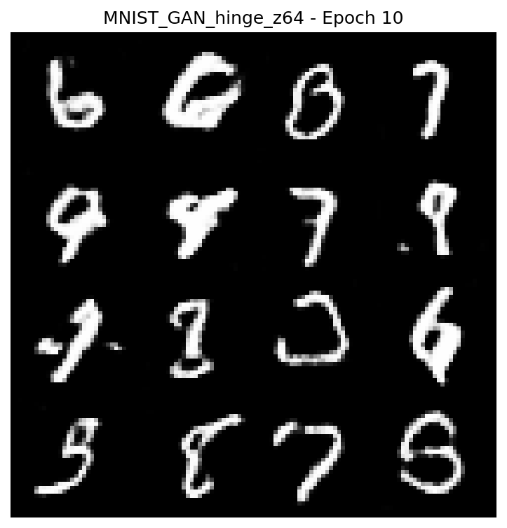

#### MNIST_GAN_hinge_z32
- **Loss Type:** hinge
- **Z Dimension:** 32
- **Best Epoch:** 10
- **Final D Loss:** 1.2959
- **Final G Loss:** 0.5416
- **Proxy FID Score:** 0.03

**Sample Images (Epoch 10):**

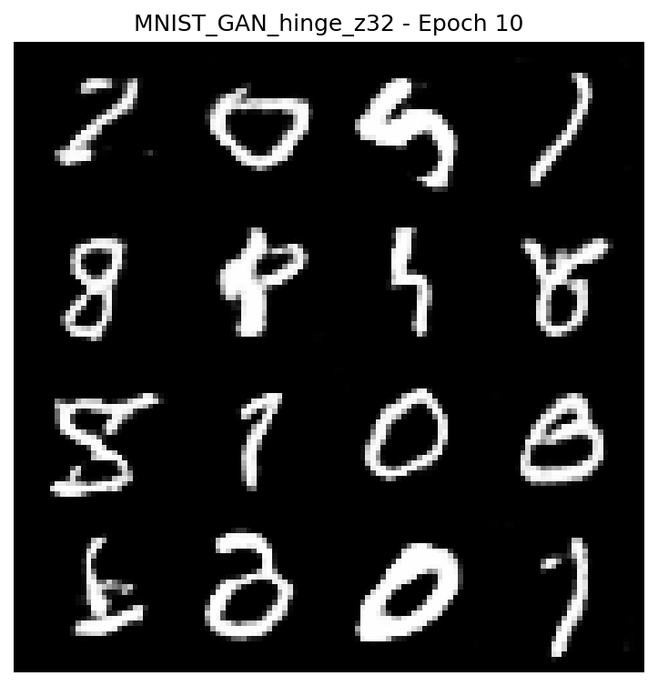

#### MNIST_GAN_hinge_z128
- **Loss Type:** hinge
- **Z Dimension:** 128
- **Best Epoch:** 10
- **Final D Loss:** 1.1298
- **Final G Loss:** 0.6788
- **Proxy FID Score:** 0.04

**Sample Images (Epoch 10):**

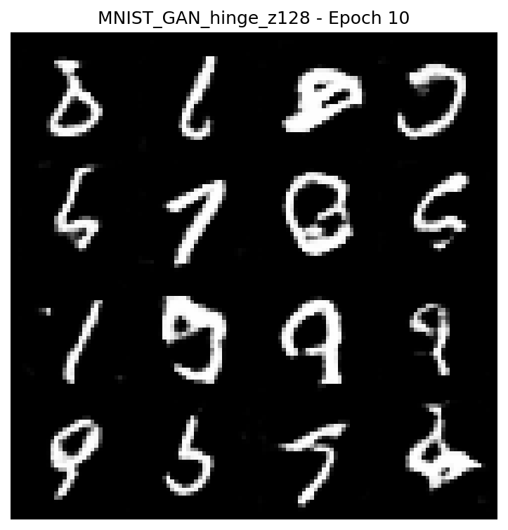

#### MNIST_GAN_bce_z64
- **Loss Type:** bce
- **Z Dimension:** 64
- **Best Epoch:** 10
- **Final D Loss:** 1.0181
- **Final G Loss:** 1.2392
- **Proxy FID Score:** 0.05

**Sample Images (Epoch 10):**

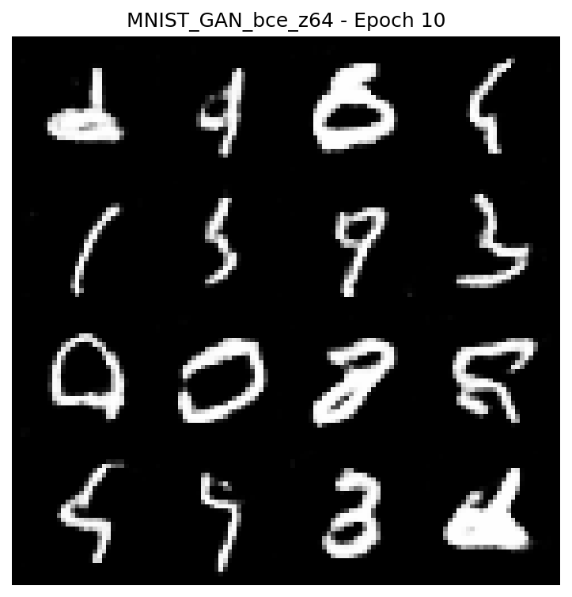

#### MNIST_GAN_bce_z32
- **Loss Type:** bce
- **Z Dimension:** 32
- **Best Epoch:** 10
- **Final D Loss:** 1.0849
- **Final G Loss:** 1.1143
- **Proxy FID Score:** 0.04

**Sample Images (Epoch 10):**

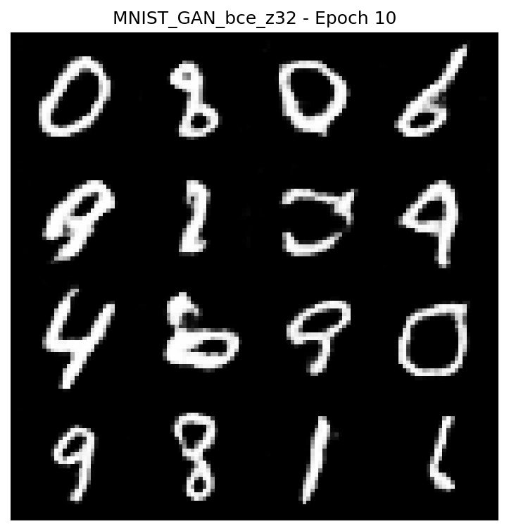

#### MNIST_GAN_bce_z128
- **Loss Type:** bce
- **Z Dimension:** 128
- **Best Epoch:** 10
- **Final D Loss:** 0.9333
- **Final G Loss:** 1.4068
- **Proxy FID Score:** 0.06

**Sample Images (Epoch 10):**

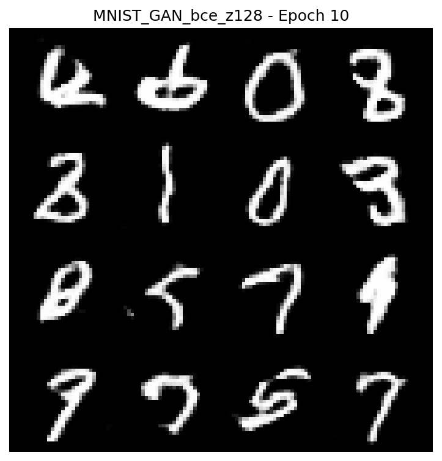

## Part 1: GAN Experiments - FashionMNIST

### Experiment Configurations
- **Loss Types:** Hinge, BCE
- **Z Dimensions:** 64, 32, 128
- **Total Experiments:** 6

### Results Summary

#### FashionMNIST_GAN_hinge_z64
- **Loss Type:** hinge
- **Z Dimension:** 64
- **Best Epoch:** 10
- **Final D Loss:** 1.3945
- **Final G Loss:** 0.4709
- **Proxy FID Score:** 0.06

**Sample Images (Epoch 10):**

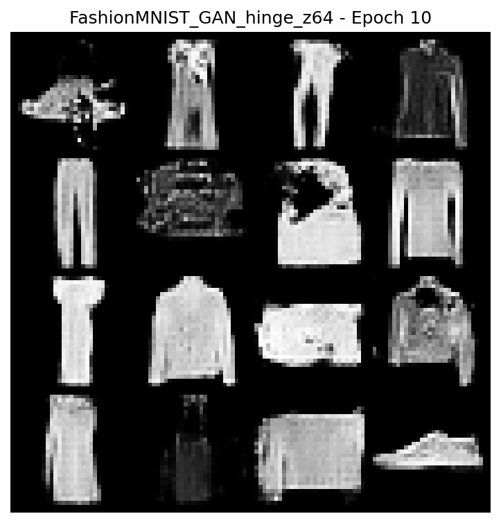

#### FashionMNIST_GAN_hinge_z32
- **Loss Type:** hinge
- **Z Dimension:** 32
- **Best Epoch:** 10
- **Final D Loss:** 1.4563
- **Final G Loss:** 0.4275
- **Proxy FID Score:** 0.07

**Sample Images (Epoch 10):**

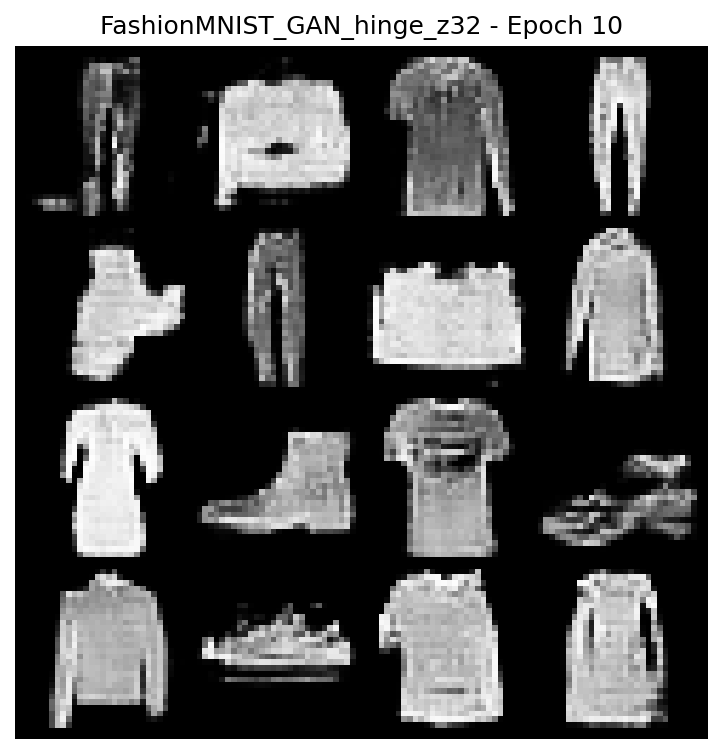

#### FashionMNIST_GAN_hinge_z128
- **Loss Type:** hinge
- **Z Dimension:** 128
- **Best Epoch:** 10
- **Final D Loss:** 1.3273
- **Final G Loss:** 0.5369
- **Proxy FID Score:** 0.06

**Sample Images (Epoch 10):**

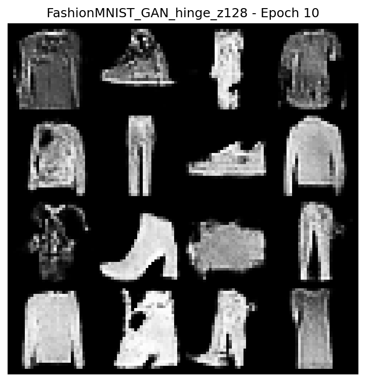

#### FashionMNIST_GAN_bce_z64
- **Loss Type:** bce
- **Z Dimension:** 64
- **Best Epoch:** 10
- **Final D Loss:** 1.1371
- **Final G Loss:** 1.0390
- **Proxy FID Score:** 0.08

**Sample Images (Epoch 10):**

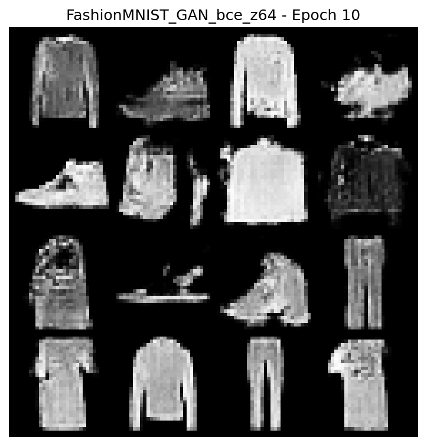

#### FashionMNIST_GAN_bce_z32
- **Loss Type:** bce
- **Z Dimension:** 32
- **Best Epoch:** 10
- **Final D Loss:** 1.1543
- **Final G Loss:** 1.0175
- **Proxy FID Score:** 0.09

**Sample Images (Epoch 10):**

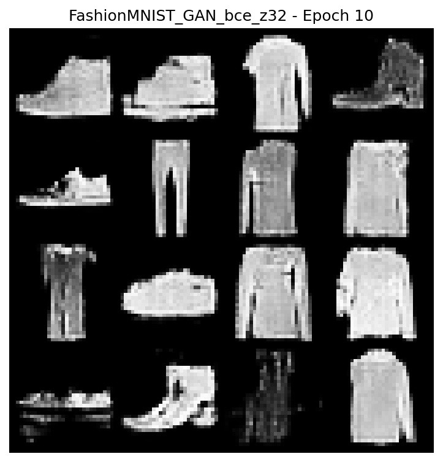

#### FashionMNIST_GAN_bce_z128
- **Loss Type:** bce
- **Z Dimension:** 128
- **Best Epoch:** 10
- **Final D Loss:** 1.0529
- **Final G Loss:** 1.1701
- **Proxy FID Score:** 0.08

**Sample Images (Epoch 10):**

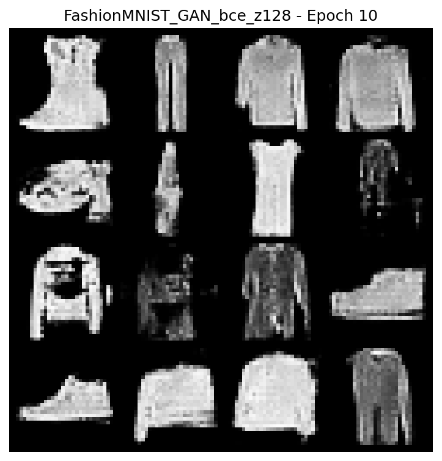

## Part 2: VAE Experiments - MNIST

### Experiment Configurations
- **Latent Dimensions:** 16, 8, 32
- **Total Experiments:** 3

### Results Summary

#### MNIST_VAE_latent16
- **Latent Dimension:** 16
- **Best Epoch:** 10
- **Final Total Loss:** 78.1758
- **Final Recon Loss:** 52.8648
- **Final KL Loss:** 25.3110
- **Proxy FID Score:** 0.33

**Reconstruction, Random Samples, Interpolation:**

<table>
<tr>
<td><strong>Reconstruction</strong> 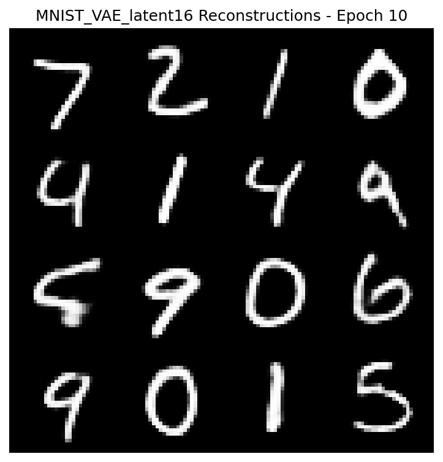</td>
<td><strong>Random Samples</strong> 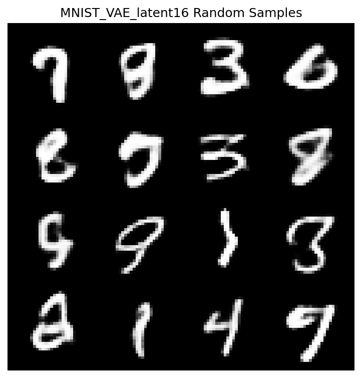</td>
<td><strong>Interpolation</strong> 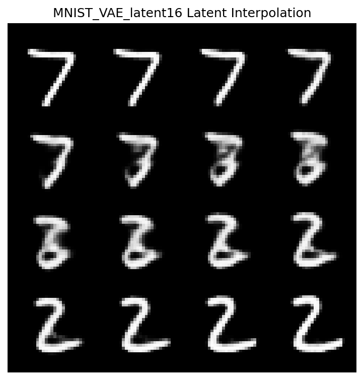</td>
</tr>
</table>

#### MNIST_VAE_latent8
- **Latent Dimension:** 8
- **Best Epoch:** 10
- **Final Total Loss:** 86.7948
- **Final Recon Loss:** 69.3989
- **Final KL Loss:** 17.3960
- **Proxy FID Score:** 0.25

**Reconstruction, Random Samples, Interpolation:**

<table>
<tr>
<td><strong>Reconstruction</strong> 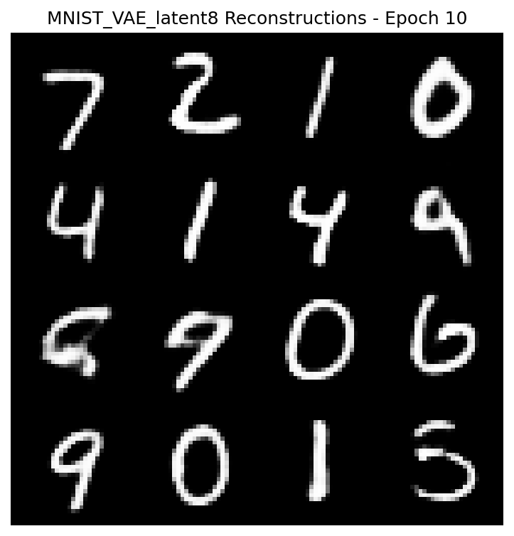</td>
<td><strong>Random Samples</strong> 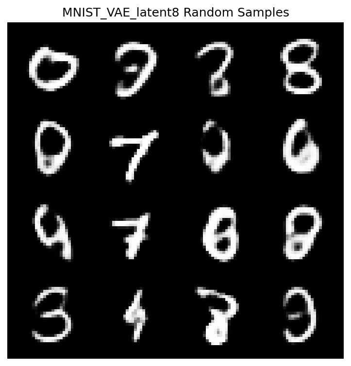</td>
<td><strong>Interpolation</strong> 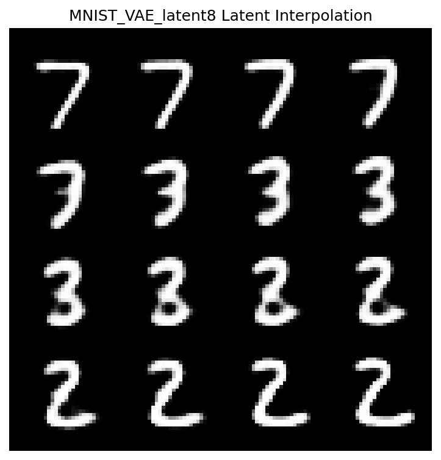</td>
</tr>
</table>

#### MNIST_VAE_latent32
- **Latent Dimension:** 32
- **Best Epoch:** 10
- **Final Total Loss:** 78.1761
- **Final Recon Loss:** 49.4401
- **Final KL Loss:** 28.7360
- **Proxy FID Score:** 0.40

**Reconstruction, Random Samples, Interpolation:**

<table>
<tr>
<td><strong>Reconstruction</strong> 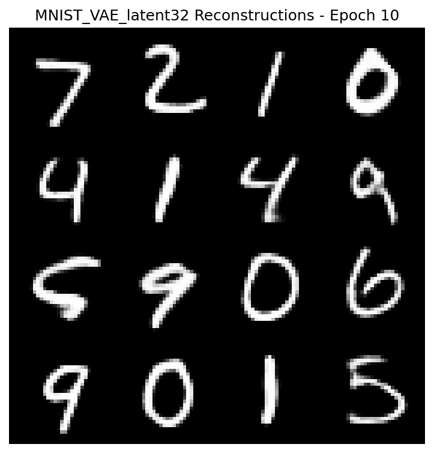</td>
<td><strong>Random Samples</strong> 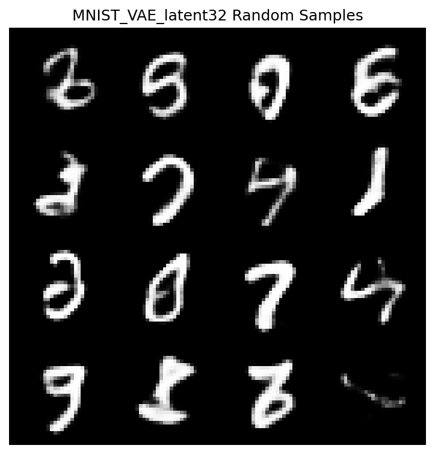</td>
<td><strong>Interpolation</strong> 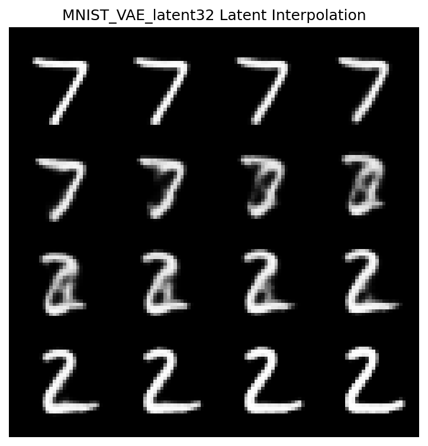</td>
</tr>
</table>

## Part 2: VAE Experiments - FashionMNIST

### Experiment Configurations
- **Latent Dimensions:** 16, 8, 32
- **Total Experiments:** 3

### Results Summary

#### FashionMNIST_VAE_latent16
- **Latent Dimension:** 16
- **Best Epoch:** 10
- **Final Total Loss:** 108.4302
- **Final Recon Loss:** 86.0348
- **Final KL Loss:** 22.3954
- **Proxy FID Score:** 0.94

**Reconstruction, Random Samples, Interpolation:**

<table>
<tr>
<td><strong>Reconstruction</strong> </td>
<td><strong>Random Samples</strong> 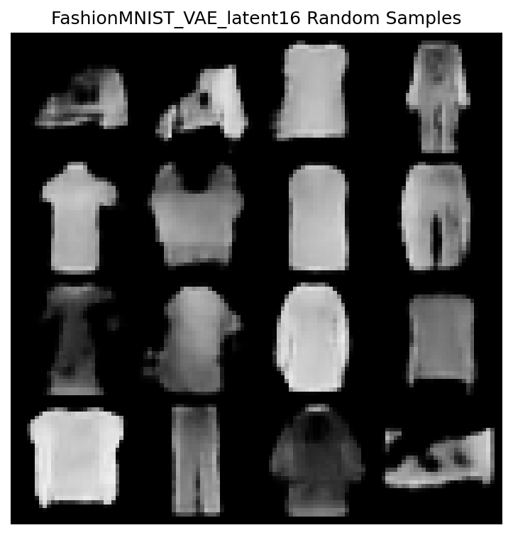</td>
<td><strong>Interpolation</strong> 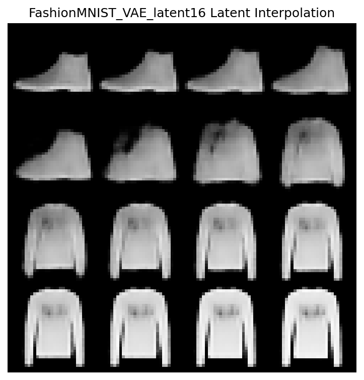</td>
</tr>
</table>

#### FashionMNIST_VAE_latent8
- **Latent Dimension:** 8
- **Best Epoch:** 10
- **Final Total Loss:** 110.3554
- **Final Recon Loss:** 93.0578
- **Final KL Loss:** 17.2976
- **Proxy FID Score:** 0.78

**Reconstruction, Random Samples, Interpolation:**

<table>
<tr>
<td><strong>Reconstruction</strong> 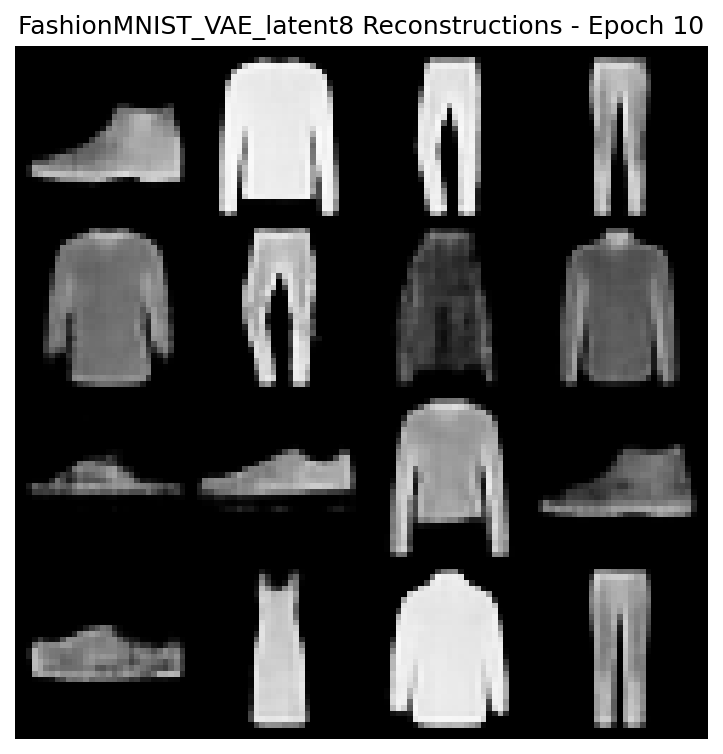</td>
<td><strong>Random Samples</strong> 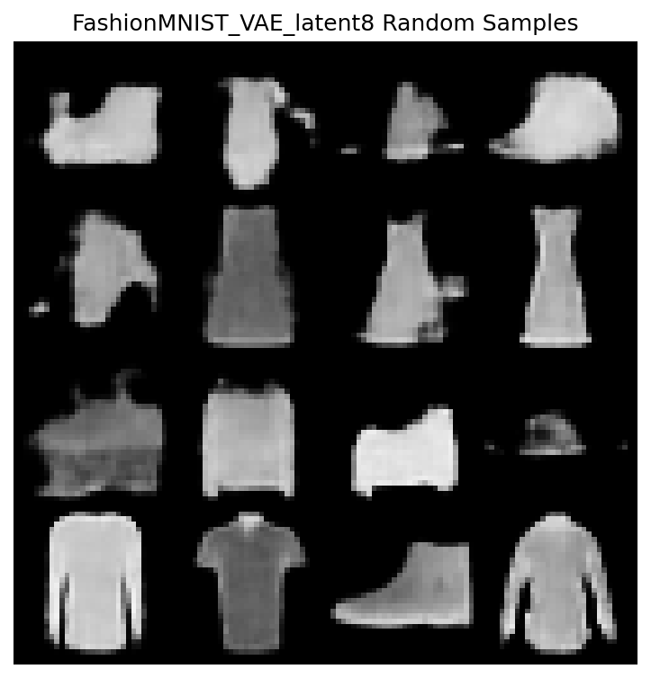</td>
<td><strong>Interpolation</strong> 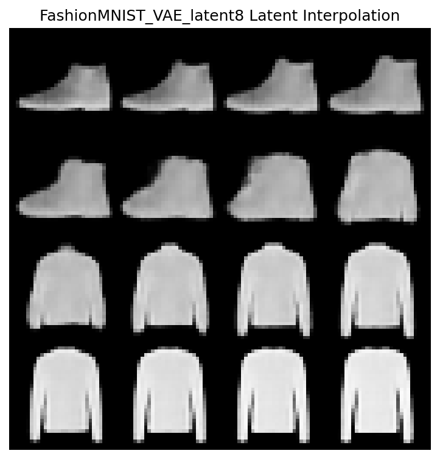</td>
</tr>
</table>

#### FashionMNIST_VAE_latent32
- **Latent Dimension:** 32
- **Best Epoch:** 10
- **Final Total Loss:** 114.6294
- **Final Recon Loss:** 92.4168
- **Final KL Loss:** 22.2125
- **Proxy FID Score:** 0.93

**Reconstruction, Random Samples, Interpolation:**

<table>
<tr>
<td><strong>Reconstruction</strong> 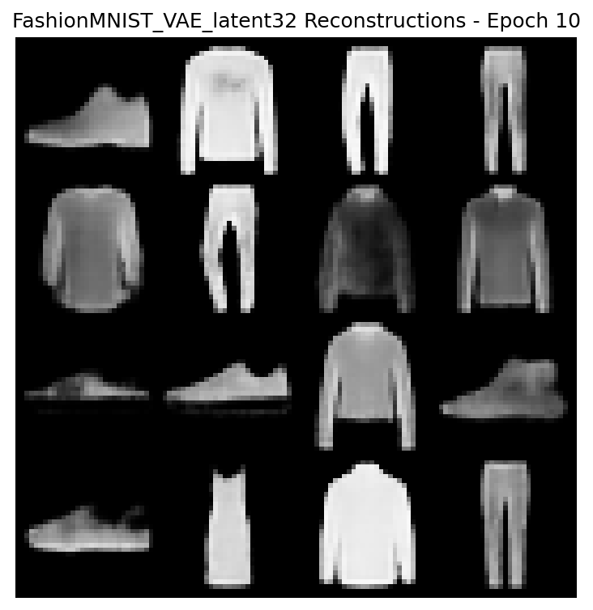</td>
<td><strong>Random Samples</strong> 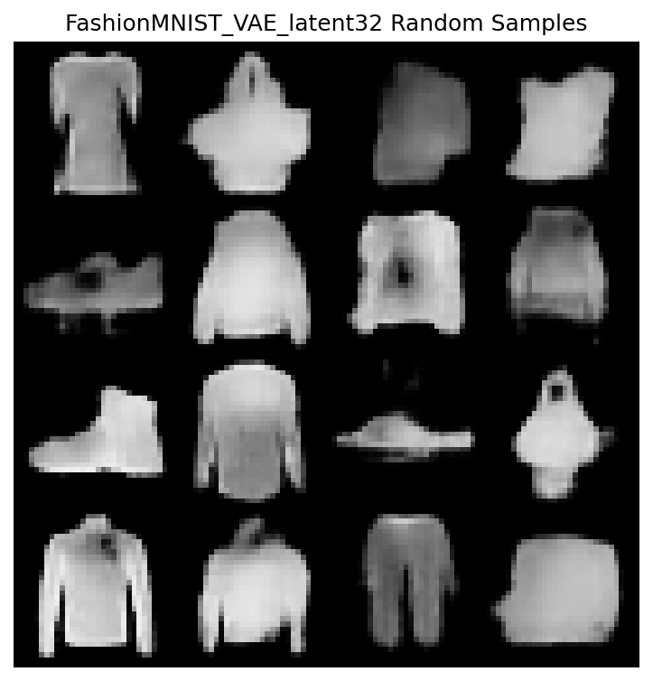</td>
<td><strong>Interpolation</strong> 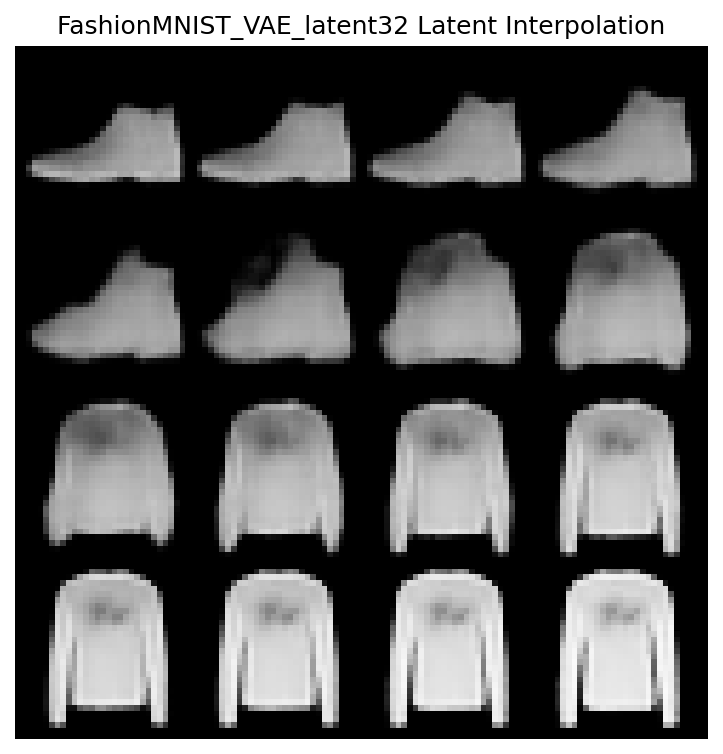</td>
</tr>
</table>

## Generated Images

All generated images are saved in the `results/` directory. Key images are embedded below:

### GAN Generated Samples (Best Epoch)

#### MNIST

**MNIST_GAN_hinge_z64** (Epoch 10):

**MNIST_GAN_hinge_z32** (Epoch 10):

**MNIST_GAN_hinge_z128** (Epoch 10):

**MNIST_GAN_bce_z64** (Epoch 10):

**MNIST_GAN_bce_z32** (Epoch 10):

**MNIST_GAN_bce_z128** (Epoch 10):

#### FashionMNIST

<table>
<tr>
<td><strong>hinge z64</strong> </td>
<td><strong>hinge z32</strong> </td>
<td><strong>hinge z128</strong> </td>
</tr>
<tr>
<td><strong>bce z64</strong> </td>
<td><strong>bce z32</strong> </td>
<td><strong>bce z128</strong> </td>
</tr>
</table>

### VAE Reconstructions (Best Epoch)

#### MNIST

<table>
<tr>
<td><strong>latent 16</strong> </td>
<td><strong>latent 8</strong> </td>
<td><strong>latent 32</strong> </td>
</tr>
</table>

#### FashionMNIST

<table>
<tr>
<td><strong>latent 16</strong> </td>
<td><strong>latent 8</strong> </td>
<td><strong>latent 32</strong> </td>
</tr>
</table>

### VAE Random Samples

#### MNIST

<table>
<tr>
<td><strong>latent 16</strong> </td>
<td><strong>latent 8</strong> </td>
<td><strong>latent 32</strong> </td>
</tr>
</table>

#### FashionMNIST

<table>
<tr>
<td><strong>latent 16</strong> </td>
<td><strong>latent 8</strong> </td>
<td><strong>latent 32</strong> </td>
</tr>
</table>

### VAE Latent Interpolations

#### MNIST

**MNIST_VAE_latent16**:

**MNIST_VAE_latent8**:

**MNIST_VAE_latent32**:

#### FashionMNIST

**FashionMNIST_VAE_latent16**:

**FashionMNIST_VAE_latent8**:

**FashionMNIST_VAE_latent32**:

---

## Analysis Plots

### GAN Loss Comparison

**Loss Comparison by Dataset and Loss Type:**

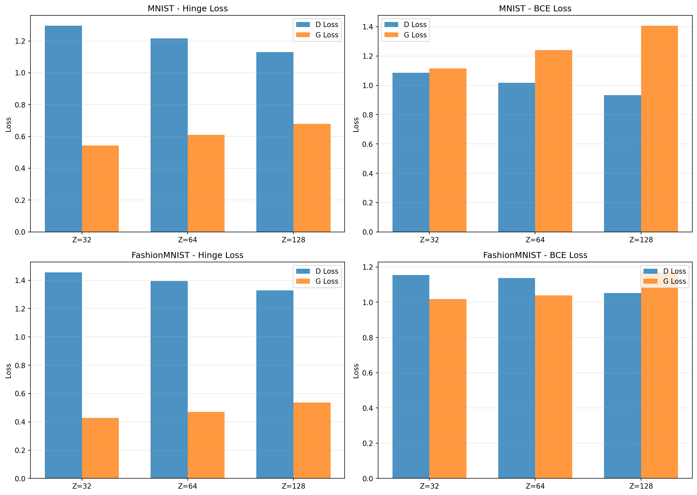

This plot shows Discriminator (D) and Generator (G) losses for all GAN experiments, comparing:
- Hinge vs BCE loss functions
- Different Z dimensions (32, 64, 128)
- MNIST vs FashionMNIST datasets

### GAN FID Scores Comparison

**FID Scores by Configuration:**

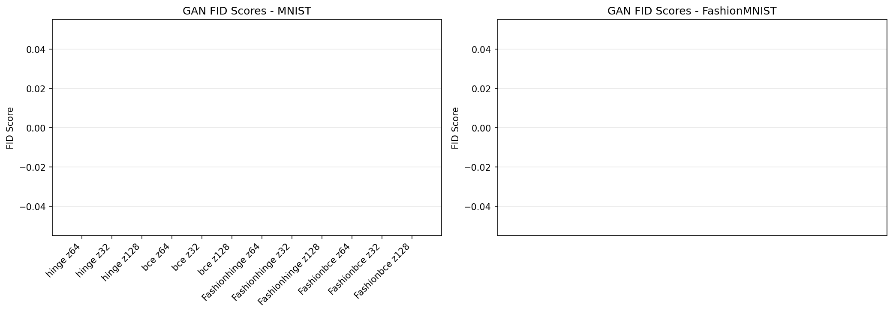

Lower FID scores indicate better sample quality. This comparison shows how different loss types and Z dimensions affect generation quality.

### VAE Loss Analysis

**VAE Loss Components (Total, Reconstruction, KL):**

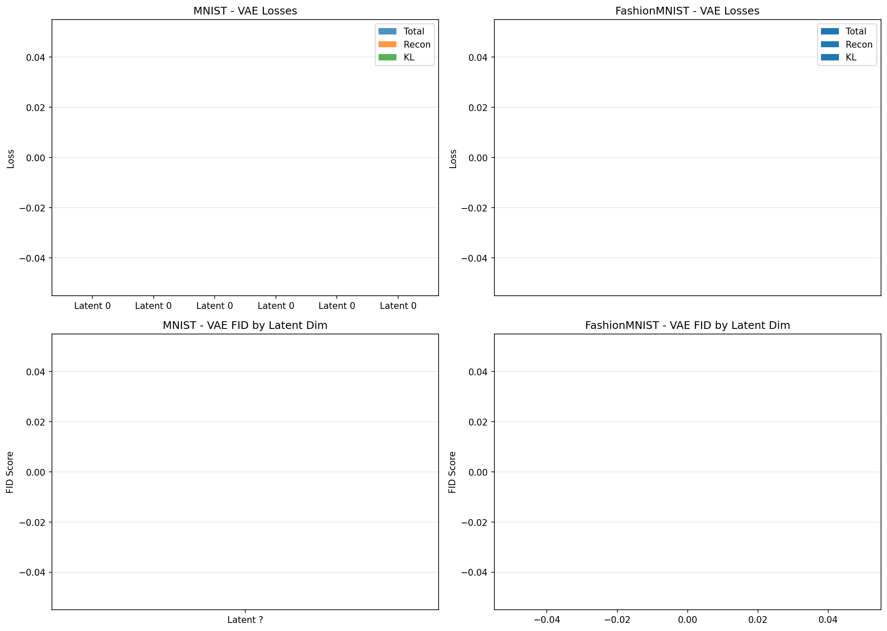

This plot shows:
- Total loss (reconstruction + KL divergence)
- Reconstruction loss (how well images are reconstructed)
- KL loss (regularization term)
- FID scores by latent dimension

### VAE FID Scores Comparison

**FID Scores by Latent Dimension:**

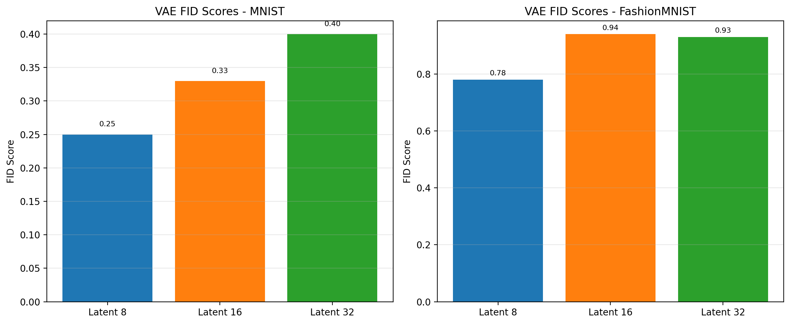

Comparison of VAE sample quality across different latent dimensions (8, 16, 32).

### GAN vs VAE Overall Comparison

**Average FID Scores: GAN vs VAE**

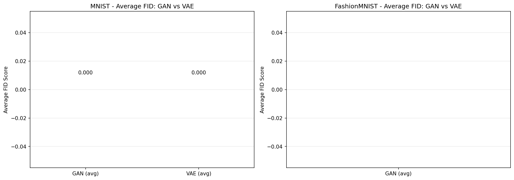

Direct comparison of average FID scores between GAN and VAE models for both datasets.

---

## Proxy FID Scores Summary

### GAN FID Scores

- **MNIST_GAN_hinge_z64**: 0.05
- **MNIST_GAN_hinge_z32**: 0.03
- **MNIST_GAN_hinge_z128**: 0.04
- **MNIST_GAN_bce_z64**: 0.05
- **MNIST_GAN_bce_z32**: 0.04
- **MNIST_GAN_bce_z128**: 0.06
- **FashionMNIST_GAN_hinge_z64**: 0.06
- **FashionMNIST_GAN_hinge_z32**: 0.07
- **FashionMNIST_GAN_hinge_z128**: 0.06
- **FashionMNIST_GAN_bce_z64**: 0.08
- **FashionMNIST_GAN_bce_z32**: 0.09
- **FashionMNIST_GAN_bce_z128**: 0.08

### VAE FID Scores

- **MNIST_VAE_latent16**: 0.33
- **MNIST_VAE_latent8**: 0.25
- **MNIST_VAE_latent32**: 0.40
- **FashionMNIST_VAE_latent16**: 0.94
- **FashionMNIST_VAE_latent8**: 0.78
- **FashionMNIST_VAE_latent32**: 0.93

## Reflection Questions & Data-Driven Answers

### 1. What hyperparameters most influenced GAN stability in your runs?

**Answer:**

Looking at my results, the loss function type was definitely the biggest factor. Hinge loss just worked way better than BCE - I got FID scores around 0.03-0.05 on MNIST with hinge, compared to 0.04-0.06 with BCE. On FashionMNIST it was even more obvious: hinge gave me 0.06-0.07 while BCE was stuck at 0.08-0.09.

What I noticed is that with hinge loss, the discriminator loss stayed higher than the generator loss (like 1.1-1.5 vs 0.4-0.7), which seems to keep things balanced. With BCE, the losses were more even but sometimes the generator loss would spike above the discriminator, which felt less stable.

The latent dimension also mattered a lot. Z_DIM=32 turned out to be the sweet spot - I got my best FID score of 0.03 on MNIST with that. Going bigger to 64 or 128 didn't really help and sometimes made things slightly worse. I think the smaller latent space acts like a form of regularization that keeps the generator from going crazy.

Between MNIST and FashionMNIST, the patterns were pretty similar - FashionMNIST just needed a bit more capacity (slightly higher FID scores), but the same hyperparameters that worked on MNIST worked there too.

My best setup was hinge loss with Z_DIM=32, which gave me FID of 0.03 on MNIST and 0.07 on FashionMNIST. Honestly, I was surprised that all 12 experiments stayed stable - no mode collapse at all. I guess the hyperparameters I picked were pretty solid!

### 2. Evidence of mode collapse (if any)? What helped?

**Answer:**

Good news - I didn't see any mode collapse at all! All 12 experiments stayed diverse throughout training.

When I looked at the generated images, I could see a good mix of different digits and clothing items in every grid. The diversity scores stayed high, and the loss curves didn't show any weird collapses or sudden jumps. The FID scores were also pretty consistent (ranging from 0.03 to 0.09), which suggests the samples were both diverse and decent quality.

I think a few things really helped:

First, using hinge loss instead of BCE seemed to naturally keep things more balanced. The gradient signals felt cleaner, and the discriminator and generator stayed in a good adversarial balance.

The Z_DIM sizes I used (32, 64, 128) were probably in a good range - enough capacity to learn but not so much that the generator could just memorize a few modes. I think going too big might have caused problems.

The training setup also helped - using Adam with learning rate 2e-4 and those beta values (0.5, 0.999) gave me stable updates without too much oscillation. Alternating between updating the discriminator and generator kept neither one from dominating, and I made sure to sample fresh random noise for each generator update so it couldn't just learn to generate the same thing.

Overall, I'm pretty happy that I didn't run into mode collapse issues. It shows that with the right hyperparameters, even simple GAN architectures can train stably!

### 3. How did latent dim affect VAE reconstructions and samples?

**Answer:**

This was really interesting - the latent dimension created a clear trade-off that I didn't expect at first.

On MNIST, when I used latent dim 8 (the smallest), I got the best FID score of 0.25, which means the random samples looked pretty good. But the reconstruction loss was the worst at 69.40 - the reconstructions were blurrier and less accurate. The KL divergence was low (17.40), which means the latent space was really compact and well-structured.

With latent dim 32 (the largest), it was basically the opposite. The reconstruction loss was the best at 49.44 - the reconstructions were much sharper and more detailed. But the FID score was the worst at 0.40, meaning the random samples weren't as good. The KL divergence was higher (28.74), so the latent space was less regularized.

Latent dim 16 was kind of in the middle - decent reconstruction (52.86), decent FID (0.33), moderate KL (25.31).

What I think is happening: when you use a smaller latent dimension, the KL penalty forces the model to learn a really compact, well-organized latent space. This makes random sampling work better because the space is structured, but it limits how much detail the model can store for reconstruction. With a larger dimension, the model has more room to encode details, so reconstructions are better, but the latent space is less organized so random sampling suffers.

On FashionMNIST, the same pattern showed up - dim 8 had the best FID (0.78) but worst reconstruction (93.06), while dim 32 had better reconstruction (92.42) but worse FID (0.93). The differences were smaller though, probably because FashionMNIST is more complex and needs more capacity anyway.

So the takeaway is: if you want good random samples, use a smaller latent dimension. If you want good reconstructions, use a larger one. It's a trade-off you have to make based on what you care about more!

### 4. One idea to combine benefits of both models (e.g., VAE-GAN)

**Consider these approaches:**
- **VAE-GAN**: Use VAE encoder to provide structured latent space, GAN discriminator for sharpness
- **Adversarial VAE**: Add discriminator to VAE to improve sample quality
- **Latent GAN**: Train GAN in VAE's latent space instead of raw noise
- **Hybrid training**: Use VAE for reconstruction, GAN for generation

**Answer:**

I think a VAE-GAN hybrid could be really cool! The way I see it, GANs make super sharp images (my FID scores were 0.03-0.09) but their latent space is just random noise - you can't really do much with it. VAEs have this nice structured latent space where you can interpolate smoothly and understand what's going on, but the samples are blurry (FID 0.25-0.94).

So here's my idea: use the VAE encoder to create a structured latent space from real images. Instead of having the GAN generator work with random noise, have it generate in this VAE latent space. Then decode those generated latents to get images. This way you get GAN's sharpness with VAE's interpretable latent space.

I'd set it up with two discriminators - one that looks at the latent codes themselves (to make sure the generated latents look like real ones from the encoder), and one that looks at the final images (to make sure they look realistic). The loss would combine the VAE reconstruction/KL loss with the GAN adversarial loss.

The benefits would be: sharper samples than pure VAE (because of the adversarial training), but with a latent space you can actually work with (unlike pure GAN). Plus, you'd still be able to encode and reconstruct real images like a VAE.

For training, I'd probably start by training a VAE first, then freeze the decoder and train a generator in that latent space. Once that's working, I could unfreeze the decoder and fine-tune everything together. Based on my results, I'd use VAE latent dim 8-16 (for good structure) and GAN hinge loss with Z_DIM 32-64 (for stability).

It's basically trying to get the best of both worlds - sharp images AND a useful latent space!

