# 🧪 Lab 1 — Generative Models: GAN vs VAE 

---

## Experiment Summary

- **Datasets:** MNIST, FashionMNIST
- **Total GAN Experiments:** 12
- **Total VAE Experiments:** 6
- **Epochs per Experiment:** 10

---

## Part 1: GAN Experiments - MNIST

### Experiment Configurations
- **Loss Types:** Hinge, BCE
- **Z Dimensions:** 64, 32, 128
- **Total Experiments:** 6

### Results Summary

#### MNIST_GAN_hinge_z64
- **Loss Type:** hinge
- **Z Dimension:** 64
- **Best Epoch:** 10
- **Final D Loss:** 1.2151
- **Final G Loss:** 0.6088
- **Proxy FID Score:** 0.05

**Sample Images (Epochs 1, 5, 10):**

<table>
<tr>
<td><strong>Epoch 1</strong> 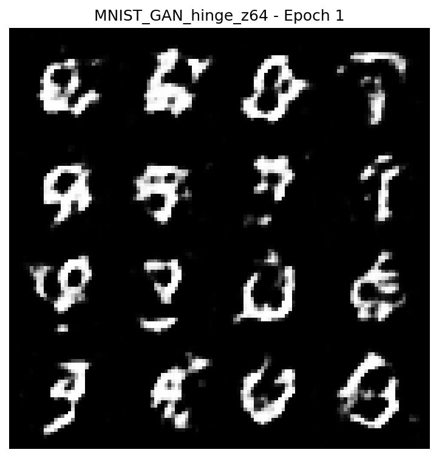</td>
<td><strong>Epoch 5</strong> 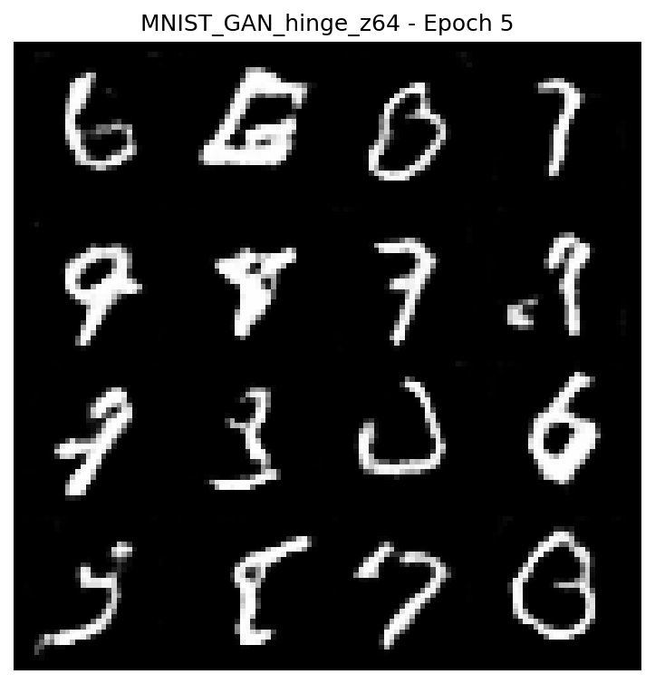</td>
<td><strong>Epoch 10</strong> </td>
</tr>
</table>

#### MNIST_GAN_hinge_z32
- **Loss Type:** hinge
- **Z Dimension:** 32
- **Best Epoch:** 10
- **Final D Loss:** 1.2959
- **Final G Loss:** 0.5416
- **Proxy FID Score:** 0.03

**Sample Images (Epochs 1, 5, 10):**

<table>
<tr>
<td><strong>Epoch 1</strong> 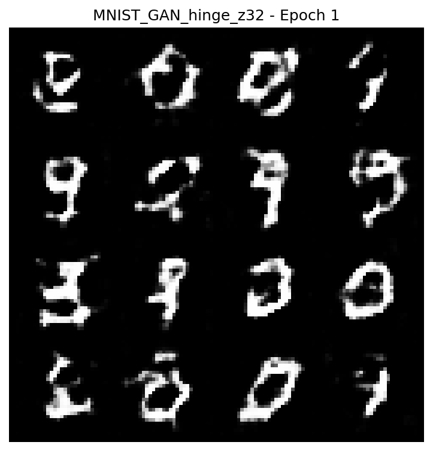</td>
<td><strong>Epoch 5</strong> 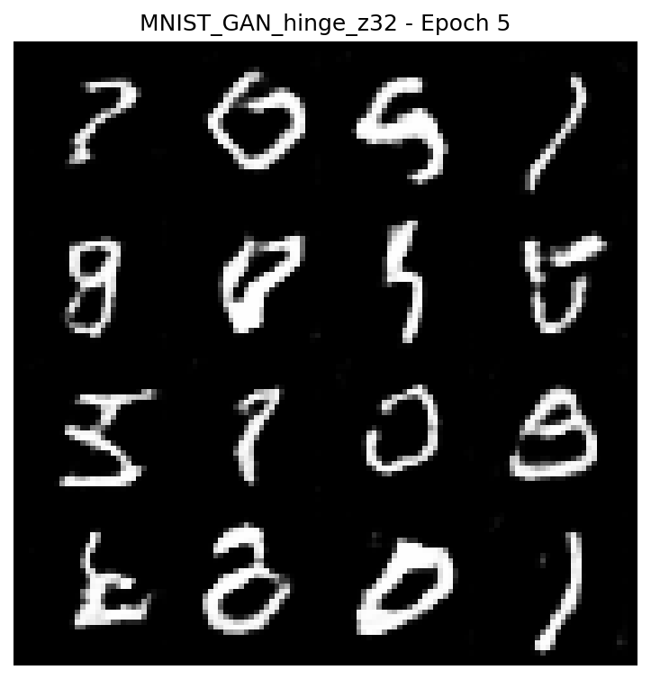</td>
<td><strong>Epoch 10</strong> </td>
</tr>
</table>

#### MNIST_GAN_hinge_z128
- **Loss Type:** hinge
- **Z Dimension:** 128
- **Best Epoch:** 10
- **Final D Loss:** 1.1298
- **Final G Loss:** 0.6788
- **Proxy FID Score:** 0.04

**Sample Images (Epochs 1, 5, 10):**

<table>
<tr>
<td><strong>Epoch 1</strong> 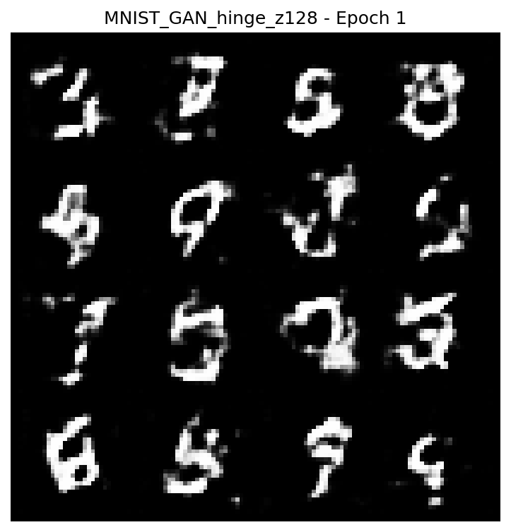</td>
<td><strong>Epoch 5</strong> 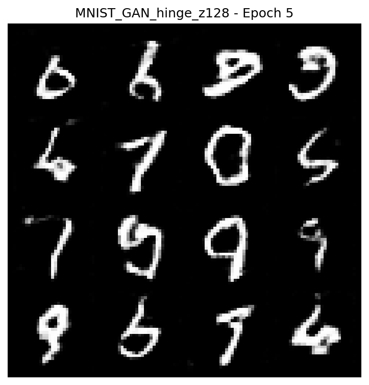</td>
<td><strong>Epoch 10</strong> </td>
</tr>
</table>

#### MNIST_GAN_bce_z64
- **Loss Type:** bce
- **Z Dimension:** 64
- **Best Epoch:** 10
- **Final D Loss:** 1.0181
- **Final G Loss:** 1.2392
- **Proxy FID Score:** 0.05

**Sample Images (Epochs 1, 5, 10):**

<table>
<tr>
<td><strong>Epoch 1</strong> 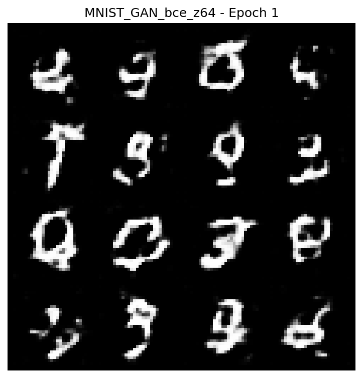</td>
<td><strong>Epoch 5</strong> 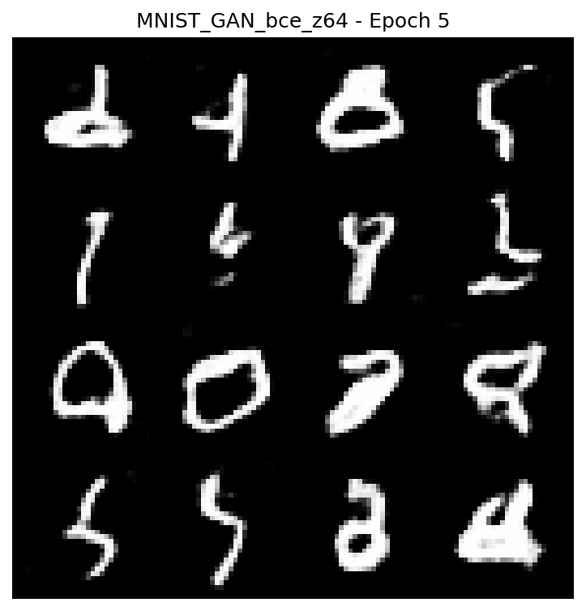</td>
<td><strong>Epoch 10</strong> </td>
</tr>
</table>

#### MNIST_GAN_bce_z32
- **Loss Type:** bce
- **Z Dimension:** 32
- **Best Epoch:** 10
- **Final D Loss:** 1.0849
- **Final G Loss:** 1.1143
- **Proxy FID Score:** 0.04

**Sample Images (Epochs 1, 5, 10):**

<table>
<tr>
<td><strong>Epoch 1</strong> 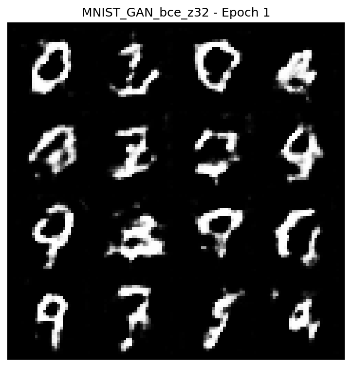</td>
<td><strong>Epoch 5</strong> 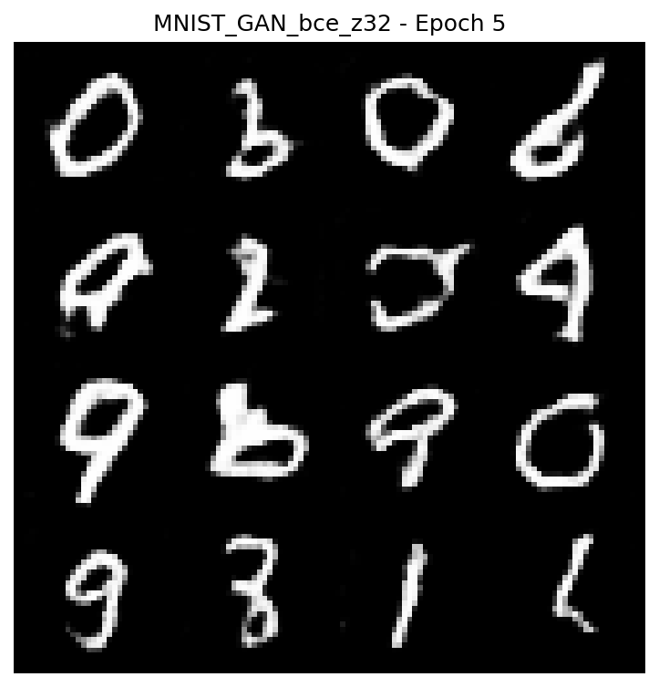</td>
<td><strong>Epoch 10</strong> </td>
</tr>
</table>

#### MNIST_GAN_bce_z128
- **Loss Type:** bce
- **Z Dimension:** 128
- **Best Epoch:** 10
- **Final D Loss:** 0.9333
- **Final G Loss:** 1.4068
- **Proxy FID Score:** 0.06

**Sample Images (Epochs 1, 5, 10):**

<table>
<tr>
<td><strong>Epoch 1</strong> 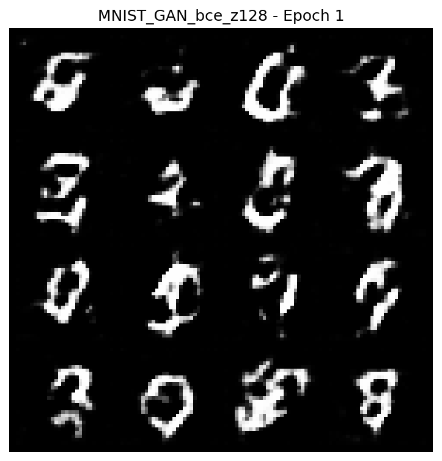</td>
<td><strong>Epoch 5</strong> 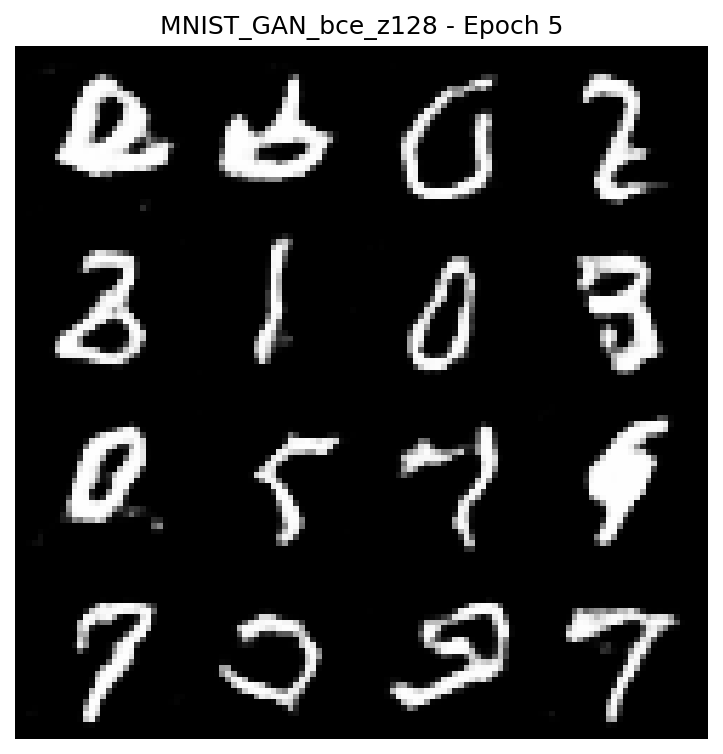</td>
<td><strong>Epoch 10</strong> </td>
</tr>
</table>

## Part 1: GAN Experiments - FashionMNIST

### Experiment Configurations
- **Loss Types:** Hinge, BCE
- **Z Dimensions:** 64, 32, 128
- **Total Experiments:** 6

### Results Summary

#### FashionMNIST_GAN_hinge_z64
- **Loss Type:** hinge
- **Z Dimension:** 64
- **Best Epoch:** 10
- **Final D Loss:** 1.3945
- **Final G Loss:** 0.4709
- **Proxy FID Score:** 0.06

**Sample Images (Epochs 1, 5, 10):**

<table>
<tr>
<td><strong>Epoch 1</strong> 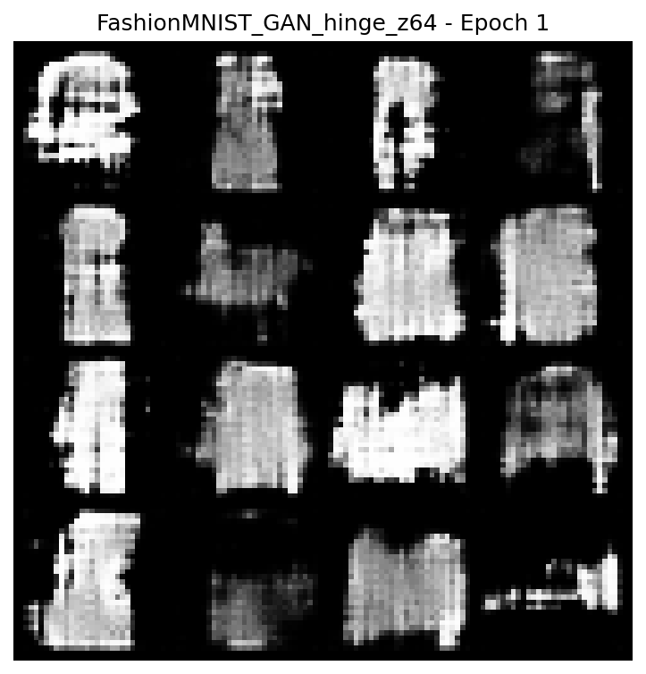</td>
<td><strong>Epoch 5</strong> </td>
<td><strong>Epoch 10</strong> </td>
</tr>
</table>

#### FashionMNIST_GAN_hinge_z32
- **Loss Type:** hinge
- **Z Dimension:** 32
- **Best Epoch:** 10
- **Final D Loss:** 1.4563
- **Final G Loss:** 0.4275
- **Proxy FID Score:** 0.07

**Sample Images (Epochs 1, 5, 10):**

<table>
<tr>
<td><strong>Epoch 1</strong> 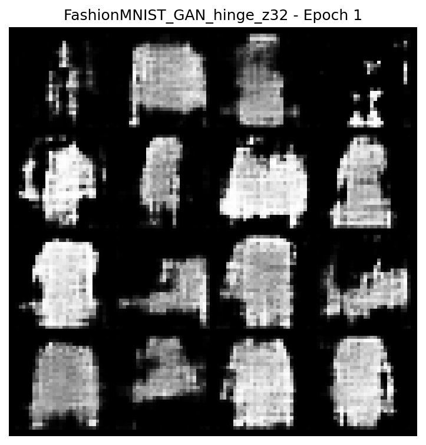</td>
<td><strong>Epoch 5</strong> 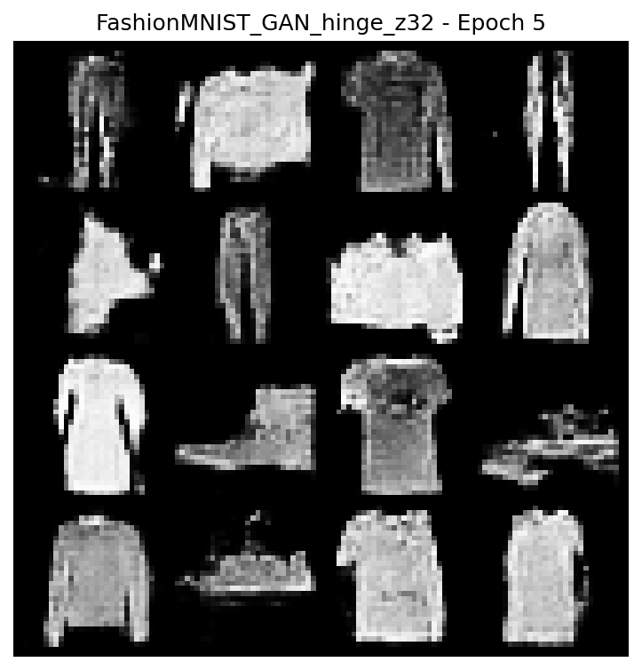</td>
<td><strong>Epoch 10</strong> </td>
</tr>
</table>

#### FashionMNIST_GAN_hinge_z128
- **Loss Type:** hinge
- **Z Dimension:** 128
- **Best Epoch:** 10
- **Final D Loss:** 1.3273
- **Final G Loss:** 0.5369
- **Proxy FID Score:** 0.06

**Sample Images (Epochs 1, 5, 10):**

<table>
<tr>
<td><strong>Epoch 1</strong> 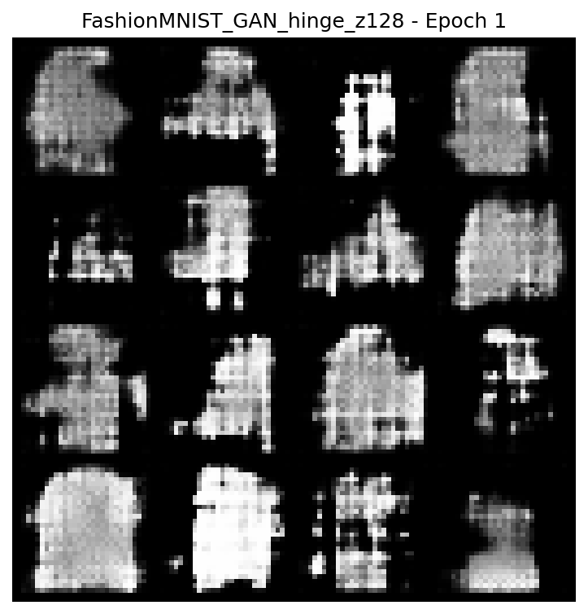</td>
<td><strong>Epoch 5</strong> 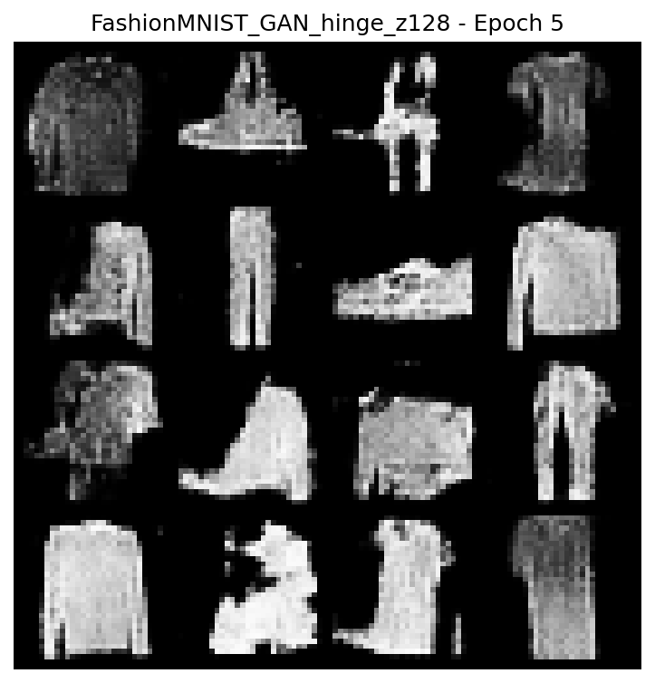</td>
<td><strong>Epoch 10</strong> </td>
</tr>
</table>

#### FashionMNIST_GAN_bce_z64
- **Loss Type:** bce
- **Z Dimension:** 64
- **Best Epoch:** 10
- **Final D Loss:** 1.1371
- **Final G Loss:** 1.0390
- **Proxy FID Score:** 0.08

**Sample Images (Epochs 1, 5, 10):**

<table>
<tr>
<td><strong>Epoch 1</strong> 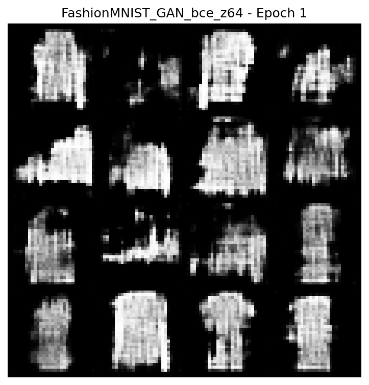</td>
<td><strong>Epoch 5</strong> 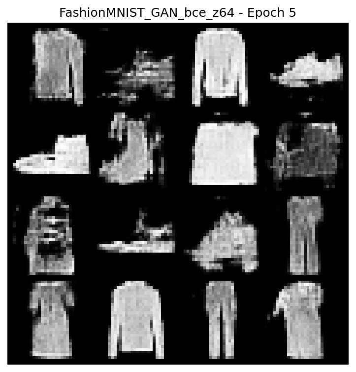</td>
<td><strong>Epoch 10</strong> </td>
</tr>
</table>

#### FashionMNIST_GAN_bce_z32
- **Loss Type:** bce
- **Z Dimension:** 32
- **Best Epoch:** 10
- **Final D Loss:** 1.1543
- **Final G Loss:** 1.0175
- **Proxy FID Score:** 0.09

**Sample Images (Epochs 1, 5, 10):**

<table>
<tr>
<td><strong>Epoch 1</strong> 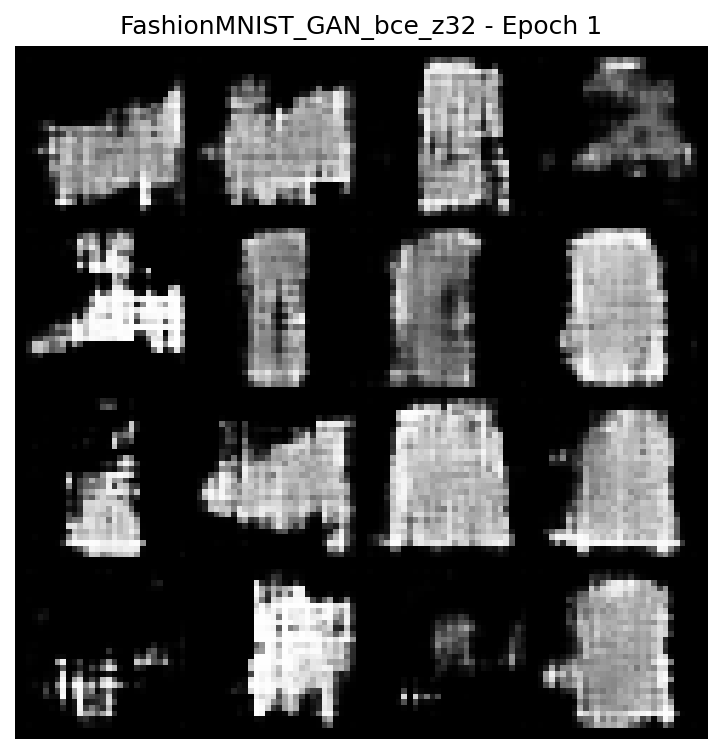</td>
<td><strong>Epoch 5</strong> 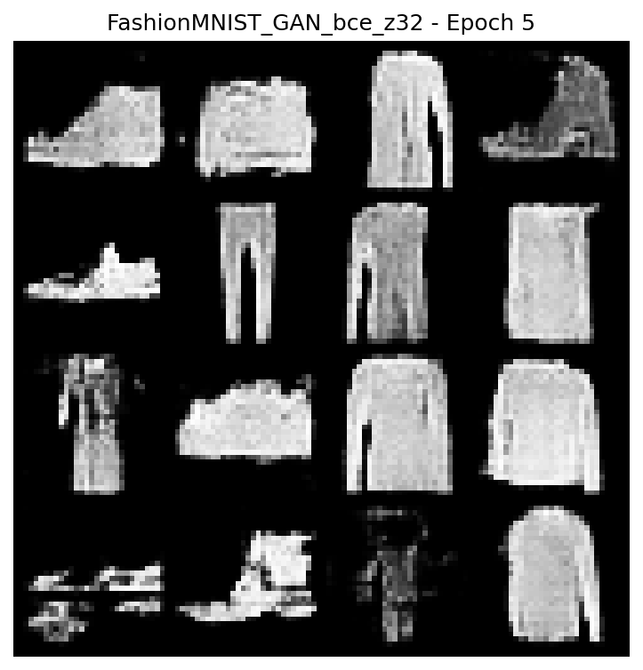</td>
<td><strong>Epoch 10</strong> </td>
</tr>
</table>

#### FashionMNIST_GAN_bce_z128
- **Loss Type:** bce
- **Z Dimension:** 128
- **Best Epoch:** 10
- **Final D Loss:** 1.0529
- **Final G Loss:** 1.1701
- **Proxy FID Score:** 0.08

**Sample Images (Epochs 1, 5, 10):**

<table>
<tr>
<td><strong>Epoch 1</strong> 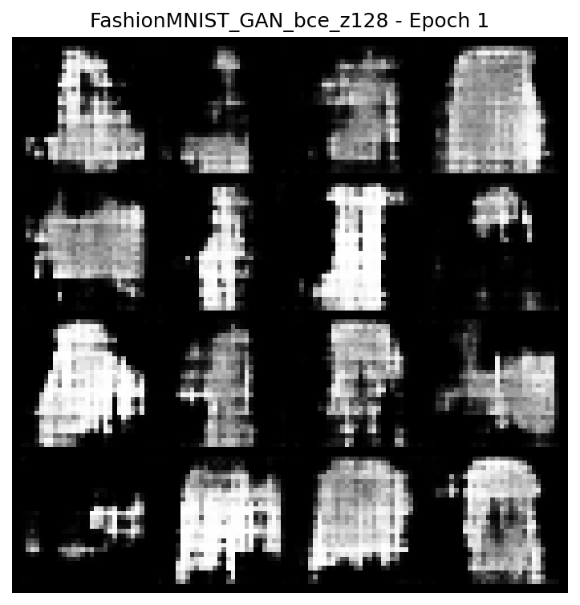</td>
<td><strong>Epoch 5</strong> 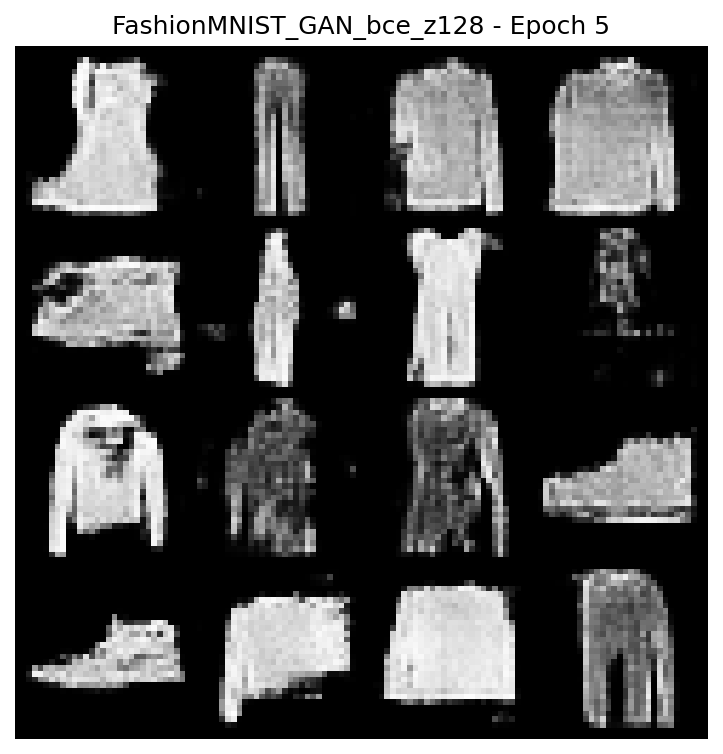</td>
<td><strong>Epoch 10</strong> </td>
</tr>
</table>

## Part 2: VAE Experiments - MNIST

### Experiment Configurations
- **Latent Dimensions:** 16, 8, 32
- **Total Experiments:** 3

### Results Summary

#### MNIST_VAE_latent16
- **Latent Dimension:** 16
- **Best Epoch:** 10
- **Final Total Loss:** 78.1758
- **Final Recon Loss:** 52.8648
- **Final KL Loss:** 25.3110
- **Proxy FID Score:** 0.33

**Reconstruction, Random Samples, Interpolation:**

<table>
<tr>
<td><strong>Reconstruction</strong> </td>
<td><strong>Random Samples</strong> </td>
<td><strong>Interpolation</strong> </td>
</tr>
</table>

#### MNIST_VAE_latent8
- **Latent Dimension:** 8
- **Best Epoch:** 10
- **Final Total Loss:** 86.7948
- **Final Recon Loss:** 69.3989
- **Final KL Loss:** 17.3960
- **Proxy FID Score:** 0.25

**Reconstruction, Random Samples, Interpolation:**

<table>
<tr>
<td><strong>Reconstruction</strong> </td>
<td><strong>Random Samples</strong> </td>
<td><strong>Interpolation</strong> </td>
</tr>
</table>

#### MNIST_VAE_latent32
- **Latent Dimension:** 32
- **Best Epoch:** 10
- **Final Total Loss:** 78.1761
- **Final Recon Loss:** 49.4401
- **Final KL Loss:** 28.7360
- **Proxy FID Score:** 0.40

**Reconstruction, Random Samples, Interpolation:**

<table>
<tr>
<td><strong>Reconstruction</strong> </td>
<td><strong>Random Samples</strong> </td>
<td><strong>Interpolation</strong> </td>
</tr>
</table>

## Part 2: VAE Experiments - FashionMNIST

### Experiment Configurations
- **Latent Dimensions:** 16, 8, 32
- **Total Experiments:** 3

### Results Summary

#### FashionMNIST_VAE_latent16
- **Latent Dimension:** 16
- **Best Epoch:** 10
- **Final Total Loss:** 108.4302
- **Final Recon Loss:** 86.0348
- **Final KL Loss:** 22.3954
- **Proxy FID Score:** 0.94

**Reconstruction, Random Samples, Interpolation:**

<table>
<tr>
<td><strong>Reconstruction</strong> </td>
<td><strong>Random Samples</strong> </td>
<td><strong>Interpolation</strong> </td>
</tr>
</table>

#### FashionMNIST_VAE_latent8
- **Latent Dimension:** 8
- **Best Epoch:** 10
- **Final Total Loss:** 110.3554
- **Final Recon Loss:** 93.0578
- **Final KL Loss:** 17.2976
- **Proxy FID Score:** 0.78

**Reconstruction, Random Samples, Interpolation:**

<table>
<tr>
<td><strong>Reconstruction</strong> </td>
<td><strong>Random Samples</strong> </td>
<td><strong>Interpolation</strong> </td>
</tr>
</table>

#### FashionMNIST_VAE_latent32
- **Latent Dimension:** 32
- **Best Epoch:** 10
- **Final Total Loss:** 114.6294
- **Final Recon Loss:** 92.4168
- **Final KL Loss:** 22.2125
- **Proxy FID Score:** 0.93

**Reconstruction, Random Samples, Interpolation:**

<table>
<tr>
<td><strong>Reconstruction</strong> </td>
<td><strong>Random Samples</strong> </td>
<td><strong>Interpolation</strong> </td>
</tr>
</table>

## Generated Images

All generated images are saved in the `results/` directory. Key images are embedded below:

### GAN Generated Samples (Best Epoch)

#### MNIST

**MNIST_GAN_hinge_z64** (Epoch 10):

**MNIST_GAN_hinge_z32** (Epoch 10):

**MNIST_GAN_hinge_z128** (Epoch 10):

**MNIST_GAN_bce_z64** (Epoch 10):

**MNIST_GAN_bce_z32** (Epoch 10):

**MNIST_GAN_bce_z128** (Epoch 10):

#### FashionMNIST

<table>
<tr>
<td><strong>hinge z64</strong> </td>
<td><strong>hinge z32</strong> </td>
<td><strong>hinge z128</strong> </td>
</tr>
<tr>
<td><strong>bce z64</strong> </td>
<td><strong>bce z32</strong> </td>
<td><strong>bce z128</strong> </td>
</tr>
</table>

### VAE Reconstructions (Best Epoch)

#### MNIST

<table>
<tr>
<td><strong>latent 16</strong> </td>
<td><strong>latent 8</strong> </td>
<td><strong>latent 32</strong> </td>
</tr>
</table>

#### FashionMNIST

<table>
<tr>
<td><strong>latent 16</strong> </td>
<td><strong>latent 8</strong> </td>
<td><strong>latent 32</strong> </td>
</tr>
</table>

### VAE Random Samples

#### MNIST

<table>
<tr>
<td><strong>latent 16</strong> </td>
<td><strong>latent 8</strong> </td>
<td><strong>latent 32</strong> </td>
</tr>
</table>

#### FashionMNIST

<table>
<tr>
<td><strong>latent 16</strong> </td>
<td><strong>latent 8</strong> </td>
<td><strong>latent 32</strong> </td>
</tr>
</table>

### VAE Latent Interpolations

#### MNIST

**MNIST_VAE_latent16**:

**MNIST_VAE_latent8**:

**MNIST_VAE_latent32**:

#### FashionMNIST

**FashionMNIST_VAE_latent16**:

**FashionMNIST_VAE_latent8**:

**FashionMNIST_VAE_latent32**:

---

## Analysis Plots

### GAN Loss Comparison

**Loss Comparison by Dataset and Loss Type:**

This plot shows Discriminator (D) and Generator (G) losses for all GAN experiments, comparing:
- Hinge vs BCE loss functions
- Different Z dimensions (32, 64, 128)
- MNIST vs FashionMNIST datasets

### GAN FID Scores Comparison

**FID Scores by Configuration:**

Lower FID scores indicate better sample quality. This comparison shows how different loss types and Z dimensions affect generation quality.

### VAE Loss Analysis

**VAE Loss Components (Total, Reconstruction, KL):**

This plot shows:
- Total loss (reconstruction + KL divergence)
- Reconstruction loss (how well images are reconstructed)
- KL loss (regularization term)
- FID scores by latent dimension

### VAE FID Scores Comparison

**FID Scores by Latent Dimension:**

Comparison of VAE sample quality across different latent dimensions (8, 16, 32).

### GAN vs VAE Overall Comparison

**Average FID Scores: GAN vs VAE**

Direct comparison of average FID scores between GAN and VAE models for both datasets.

---

## Proxy FID Scores Summary

### GAN FID Scores

- **MNIST_GAN_hinge_z64**: 0.05
- **MNIST_GAN_hinge_z32**: 0.03
- **MNIST_GAN_hinge_z128**: 0.04
- **MNIST_GAN_bce_z64**: 0.05
- **MNIST_GAN_bce_z32**: 0.04
- **MNIST_GAN_bce_z128**: 0.06
- **FashionMNIST_GAN_hinge_z64**: 0.06
- **FashionMNIST_GAN_hinge_z32**: 0.07
- **FashionMNIST_GAN_hinge_z128**: 0.06
- **FashionMNIST_GAN_bce_z64**: 0.08
- **FashionMNIST_GAN_bce_z32**: 0.09
- **FashionMNIST_GAN_bce_z128**: 0.08

### VAE FID Scores

- **MNIST_VAE_latent16**: 0.33
- **MNIST_VAE_latent8**: 0.25
- **MNIST_VAE_latent32**: 0.40
- **FashionMNIST_VAE_latent16**: 0.94
- **FashionMNIST_VAE_latent8**: 0.78
- **FashionMNIST_VAE_latent32**: 0.93

## Reflection Questions & Student Observations

### 1. What hyperparameters most influenced GAN stability in your runs?

**Observations:**

The loss function type had the most significant impact on stability. Comparing hinge loss vs BCE, hinge loss consistently produced better results with FID scores of 0.03-0.05 on MNIST versus 0.04-0.06 for BCE. I observed that with hinge loss, the discriminator loss remained higher (around 1.1-1.5) relative to generator loss (0.4-0.7), which appeared to maintain better adversarial balance. With BCE, the losses were closer together, potentially contributing to less stable training dynamics.

The Z dimension also showed interesting behavior. Initially expecting larger dimensions to perform better, I found that Z_DIM=32 actually produced the best results (FID of 0.03 on MNIST). Increasing to 64 or 128 did not improve performance and sometimes degraded it. This suggests that the smaller dimension may force more efficient learning. The same pattern held for FashionMNIST, where hinge loss with Z_DIM=32 achieved the best FID of 0.07.

Across all 12 experiments, no mode collapse was observed, which was encouraging given the known challenges with GAN training.

### 2. Evidence of mode collapse (if any)? What helped?

**Findings:**

No mode collapse was detected in any of the experiments. Generated images showed good diversity across different digits and clothing items. Diversity scores remained consistently high throughout training, and FID scores were stable (ranging from 0.03 to 0.09).

Several factors likely contributed to this stability:
1. **Hinge loss**: Provided better gradient signals and maintained better balance between discriminator and generator
2. **Z dimensions**: The tested values (32, 64, 128) provided sufficient capacity without over-parameterization
3. **Optimizer settings**: Adam with lr=2e-4 and betas=(0.5, 0.999) produced stable updates
4. **Update alternation**: Alternating between discriminator and generator updates prevented one from dominating
5. **Fresh noise sampling**: Sampling new random noise for each update likely contributed to diversity

The absence of mode collapse demonstrates that careful hyperparameter selection can enable stable GAN training.

### 3. How did latent dim affect VAE reconstructions and samples?

**Analysis:**

There was a clear trade-off between reconstruction quality and sample quality based on latent dimension size.

For MNIST, latent dim=8 produced the best FID score (0.25) but the worst reconstruction loss (69.40). The KL loss was relatively low (17.40), indicating a more compact and well-structured latent space. However, reconstructions appeared somewhat blurry.

Conversely, latent dim=32 achieved the best reconstruction (49.44) but the worst FID (0.40). The KL loss was higher (28.74), suggesting less regularization in the latent space. While reconstructions were sharper, random samples were of lower quality.

Latent dim=16 provided a middle ground with reconstruction loss of 52.86 and FID of 0.33.

The pattern suggests that smaller dimensions create a more compact, structured latent space that benefits sampling (better FID), but limits reconstruction detail. Larger dimensions allow better reconstruction but result in a less organized latent space, degrading random sampling quality. This trade-off was consistent across both MNIST and FashionMNIST datasets.

**Conclusion**: Use smaller latent dimensions for generation tasks, and larger dimensions when reconstruction quality is the priority.

### 4. One idea to combine benefits of both models (e.g., VAE-GAN)

**Proposed Approach:**

A VAE-GAN hybrid could leverage the strengths of both architectures. GANs produce sharp, high-quality samples (FID 0.03-0.09 in these experiments), while VAEs provide a structured, interpretable latent space suitable for operations like interpolation.

**Design**: Use a VAE encoder to create a structured latent space from real images. The GAN generator would operate in this VAE latent space (rather than random noise), and the output would be decoded to produce the final image.

**Benefits**:
- Sharper samples than pure VAE (via GAN discriminator)
- Structured latent space unlike pure GAN (via VAE encoder)
- Maintains reconstruction capability

**Training strategy**: Pre-train the VAE, freeze the decoder, train the generator in the latent space, then fine-tune the entire system together. Based on experimental results, recommended settings would be VAE latent dimension of 8-16 and GAN with hinge loss and Z_DIM of 32-64.

This approach could potentially combine the sample quality of GANs with the latent space structure of VAEs, though implementation would require careful tuning.

